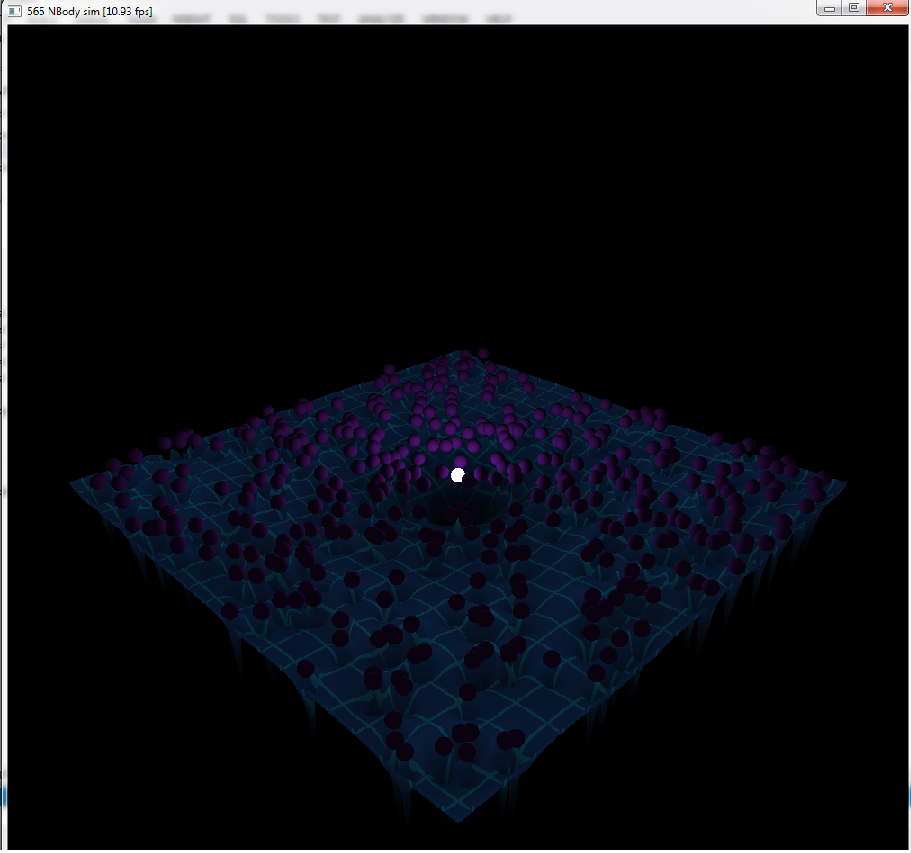
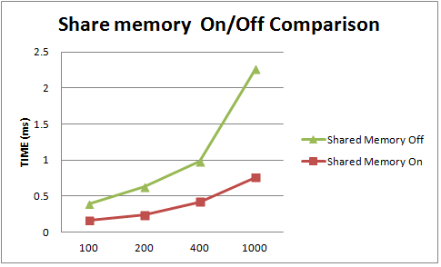
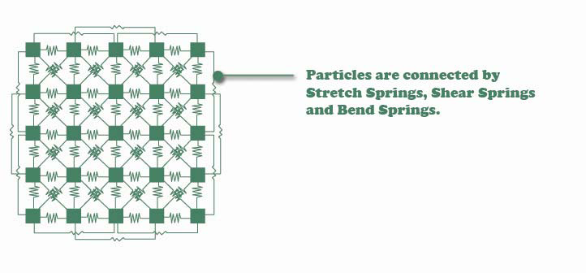
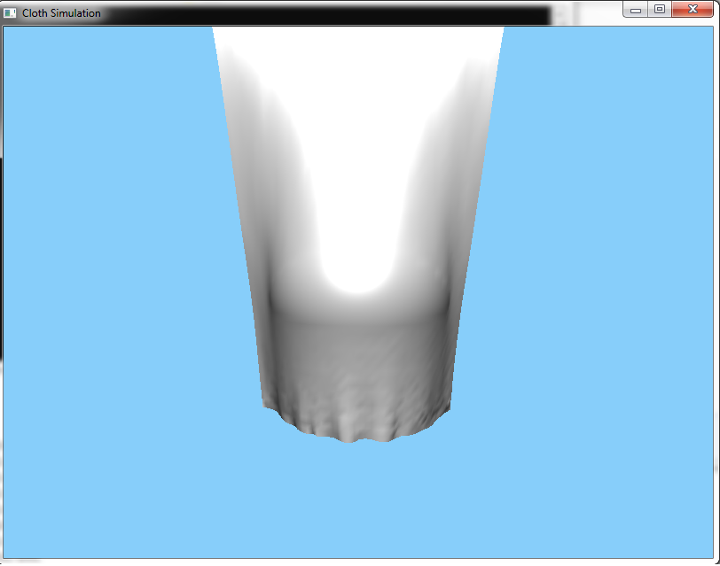
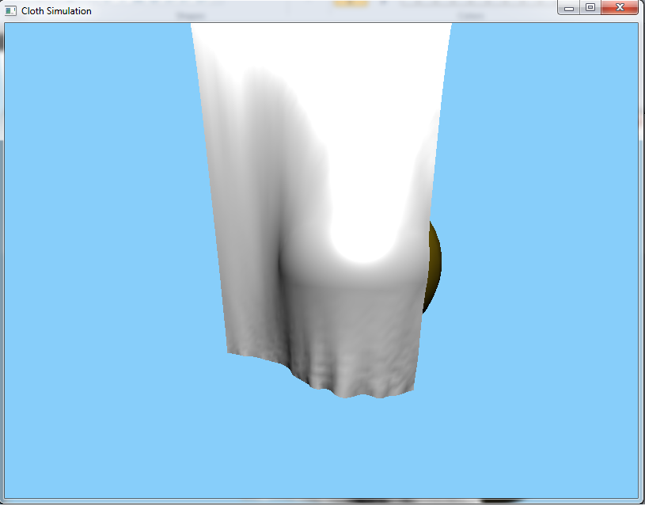
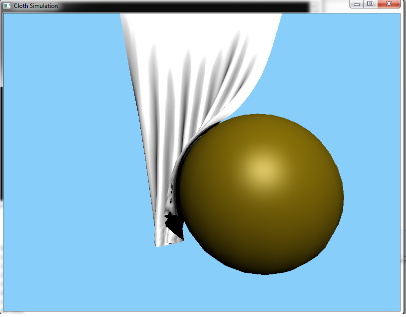

CIS565: Project 3: CUDA Simulation and GLSL Visualization
===
PART 1: CUDA NBody Simulation
===
* Features:  
 1.Use share memory to accumulate the effects of all bodies tile by tile.  
 2.A softening factor described in http://www.scholarpedia.org/article/N-body_simulations_(gravitational) is added in the force calculation to prevent force explosion when two bodies are too close.
 
 screen shot (400 bodies)  
 
 
* Performance Profiling:  
As expected, the speedup of shared memory-enabled computation is proportional to the number of bodies involved in force accumulation. GPU throughput is optimized when doing compute-intensive operations.  

 
 

PART 2: Cloth Simulation
===
* In this cloth simulation work, the Mass-Spring model described in this [paper](http://graphics.stanford.edu/courses/cs468-02-winter/Papers/Rigidcloth.pdf) is used.  
  The cloth mesh is composed of particles connected by springs.  
  We simulate the cloth internal forces by modeling 3 types of springs: structural, shear, and flexion (or bend).  
    

* In additon to gravity, a external wind force and sphere object is added into the program to demostrate the cloth-sphere mesh collsion.  
  The cloth-sphere mesh collision detection is accomplished by "push" the vertices fall inside the sphere radius to the sphere surface along the sphere surface normal.  
  Because this is extremely simplified model, ugly artifacts will show up when coarsely tessellated sphere mesh is used.  
* Verlet Integration is used for force integration. It's easy to implement and more stable than Euler Integration.

* Dynamic surface normal generation: surface normal of the cloth mesh is dynamically updated by a CUDA kernel to reflect the motion of mesh triangles.  
  For each vertex, two neighboring vertices will be picked for cross-product calculation to calculate the vertex normal.  
    
	Video Demo: [here](http://youtu.be/u3b-5hwWTjg)  
	
	Screenshot:  
	
    
	  
## Things waiting for improvement:
* The current model is quite unstable. Some kind of elongation contraints needs to be added to prevent over-stretch
* Cloth-Cloth collision, it's unrealistic without self collision detection.

## How to play:
 * Press left mouse button to control the ball.
 * press right mouse button to blow a wind.
 
 