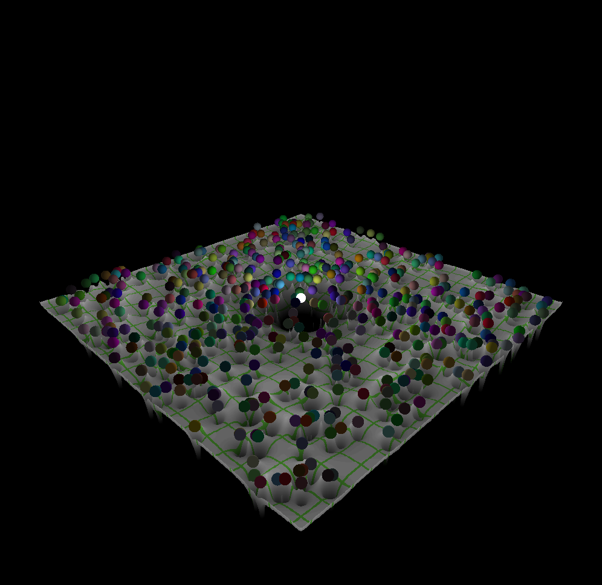
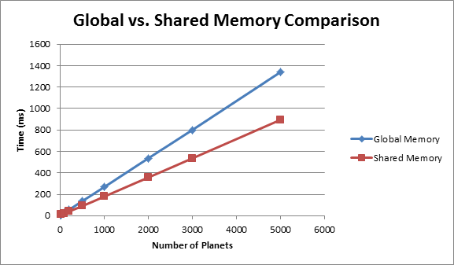

CIS565: Project 3: CUDA Simulation and GLSL Visualization
===
Fall 2013
---

PART 1: CUDA NBody Simulation
===

For the first part of this project, a N-body simulation was implemented where the center sphere represents a fixed star of mass 5e10. Each orbiting planet is initialized with 
a random velocity that points in the direction of the orbit. At every time frame, the appropriate acceleration is computed using two different memory access methods: global
memory and shared memory.

In terms of visualization, each planet is represented as a billboard by a geometry shader and shaded as a sphere with the lightsource located at the position of the fixed 
star. The plane on which each planet is traveling on has a vertex shader that renders a height field based on the acceleration of each point on the plane. The fragment shader
for the plane also provides a procedural texture.

Features Overview:
* Force Calculation between all interacting bodies using global memory and shared memory
* Height field rendering
* Billboards generating geometry shader
* Fragment shader with sphere rendering from billboards.
* Runge Kutta integration

---
PERFORMANCE EVALUATION
---

Here I provide a comparison between the number of planets in the simulation vs. the use of global memory and shared memory in terms of the average time per frame. With shared memory
frames. With small number of plants in the simulation, using global memory is faster than using shared memory. However, once the number of planets starts to increase, using shared 
memory to compute each planet's acceleration has a clear advantage.

	Number of Planets	Global Memory	Shared Memory
	20			7.6		10.6
	100			29.5		21.4
	200			55.8		40.5
	500			136.2		90.5
	1000			268.2		179.2
	2000			536.4		357.5
	3000			801.3		536.1
	5000			1340.7		895.1

PART 2: Your CUDA Simulation
===

---
PERFORMANCE EVALUATION
---

---
ACKNOWLEDGEMENTS
---
I adapted the geometry shader code from [this excellent tutorial on the subject](http://ogldev.atspace.co.uk/www/tutorial27/tutorial27.html).
I also found [this post](http://stackoverflow.com/questions/14909796/simple-pass-through-geometry-shader-with-normal-and-color) to be extermely helpful in 
regards to passing primitives from vertex shaders to geometry shaders and fragment shaders.
Lastly, regarding shared memory set up, [GPU Gem 3](http://http.developer.nvidia.com/GPUGems3/gpugems3_ch31.html) provides an excellent overview.
