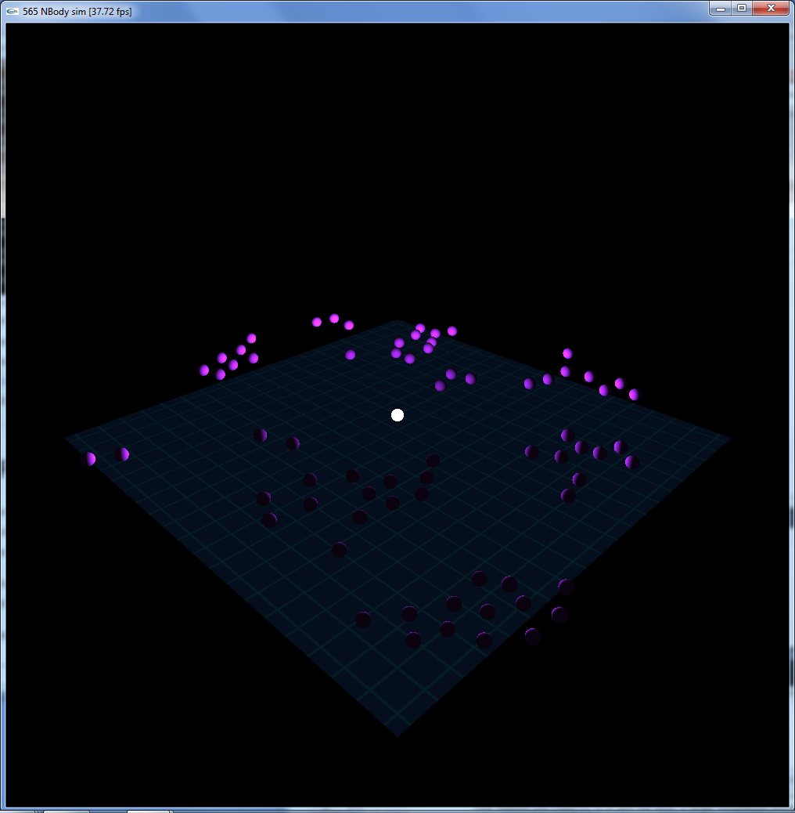

CIS565: Project 3: CUDA Simulation and GLSL Visualization
===
Fall 2013
---
Due Tuesday, 10/22/2013 by 11:59:59 pm
---

PART 1: CUDA NBody Simulation
===
---
REQUIREMENTS:
---
I was provided with code for:
 *  Initialization
 *  Rendering to the screen
 *  Some helpful math functions
 *  CUDA/OpenGL inter-op

I implemented the following features:
 *  Calculating forces between all interacting bodies
 *  The same, but with shared memory (In main.cpp there is a compile flag #define VISUALIZE that can be set to 0 in order to only run the simulation portion of the code and not the costly visualizer)
 *  Vertex shader code to render a height field
 *  Fragment shader code to light that height field
 *  Geometry shader code to create screen facing billboards from rendered points
 *  Fragment shader code to render those billboards like spheres with simple diffuse shading

PART 2: Flocking
===

I then implemented a flocking simulation, building off of the base code from Part 1.

The simulation has the following adjustable features:
 *  Cohesion
 *  Alignment
 *  Alignment acceleration
 *  Separation
 *  Separation Radius
 *  Origin-based attractor
 *  Deflection from the attractor, in a direction opposed to the current velocity



See Part2/Resources/flocking_demo for a video. The screen capture program interrupted the frame rate, so the video is choppy. It uses the following parameters:

````
#define STARTING_VEL 1.0
#define FLOCKING_RADIUS 20

#define COHESION_COEFF 0.0001
#define ALIGNMENT_COEFF 0.02
#define ALIGNMENT_BONUS 1.1
#define SEPARATION_COEFF 1
#define SEPARATION_RADIUS 10
#define SEPARATION_EPSILON 1

#define ATTRACTOR_RADIUS 120
#define ATTRACTOR_COEFF .0001
#define ATTRACTOR_DEFLECTION 0.2
````

---
PERFORMANCE EVALUATION
---

Oddly, I am getting almost exactly the same performance for the shared memory implementation as for the naive implementation:

Shared memory (blocksize, numobjects):
 * 32,  10:   275fps
 * 32,  100:  252 fps
 * 32,  1000:  84 fps
 * 64,  10:   274 fps
 * 64,  100:  261 fps
 * 64,  1000:  93 fps
 * 128, 10:   263 fps
 * 128, 100:  262 fps
 * 128, 1000:  92 fps
 * 256, 10:   268 fps
 * 256, 100:  262 fps
 * 256, 1000:  90 fps
 * 512, 10:   268 fps
 * 512, 100:  247 fps
 * 512, 1000:  93 fps

No shared memory (blocksize 128):
 * 10:  271 fps
 * 100: 245 fps
 * 1000: 90 fps

I imagine this means something is wrong with my implementation, but haven't yet been able to figure out what.
