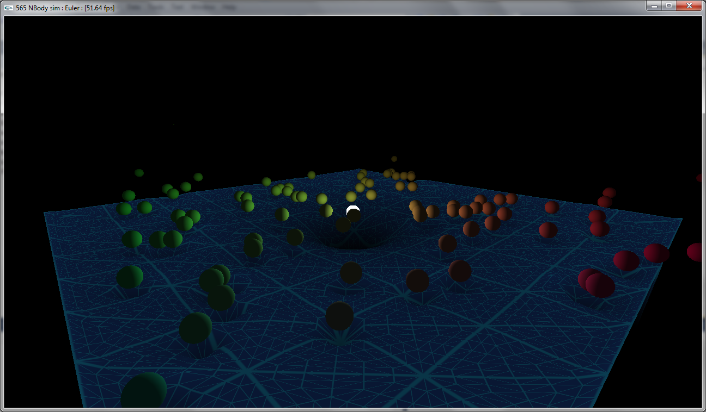
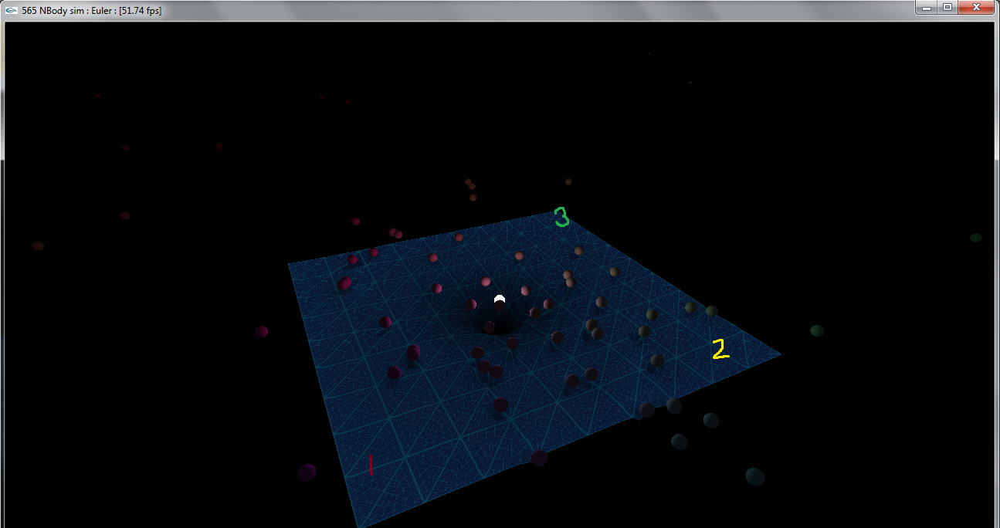
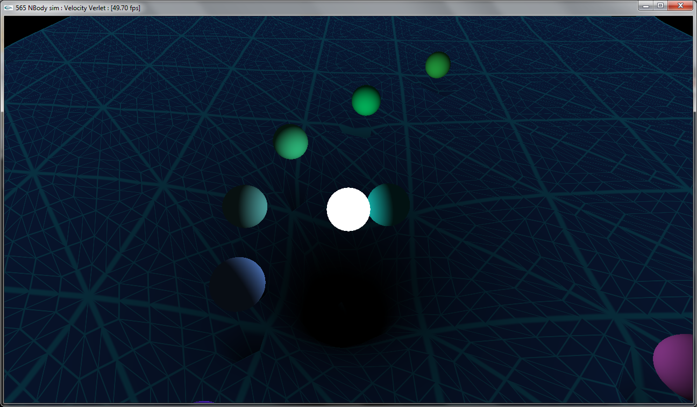
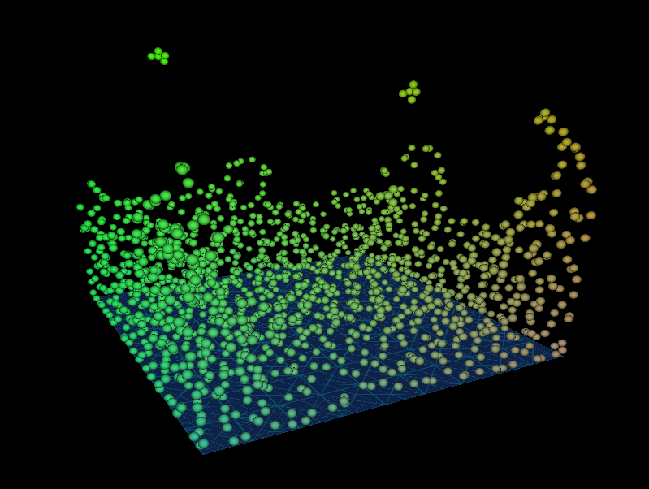
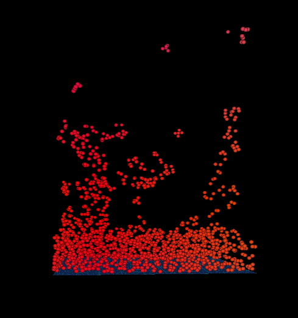
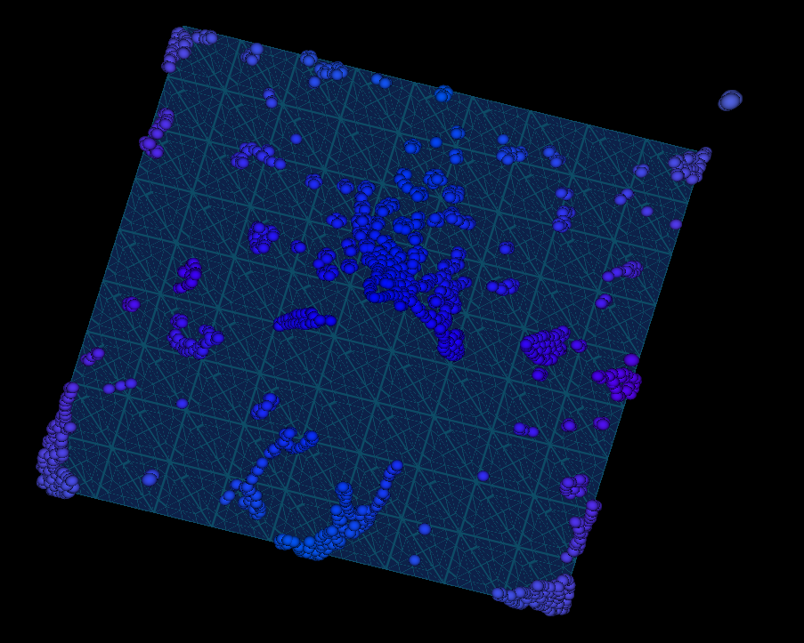
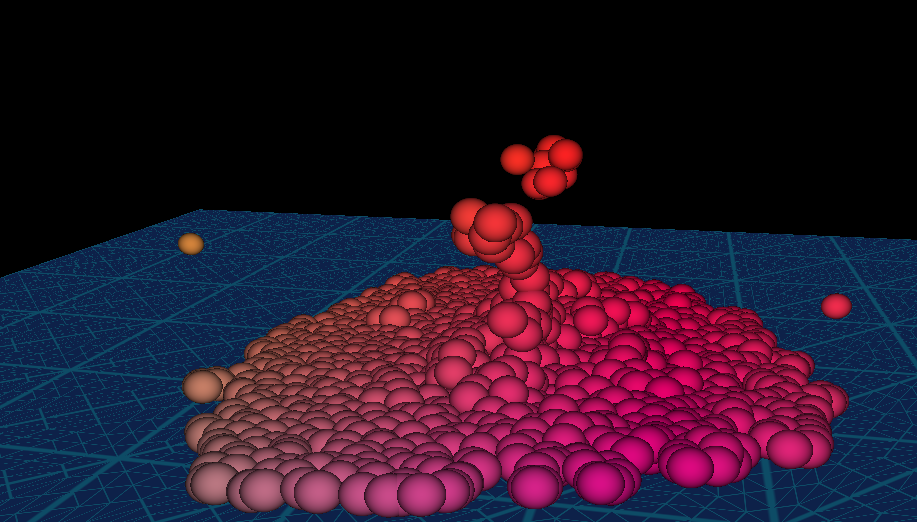
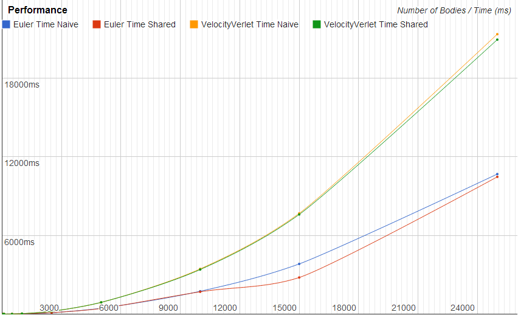
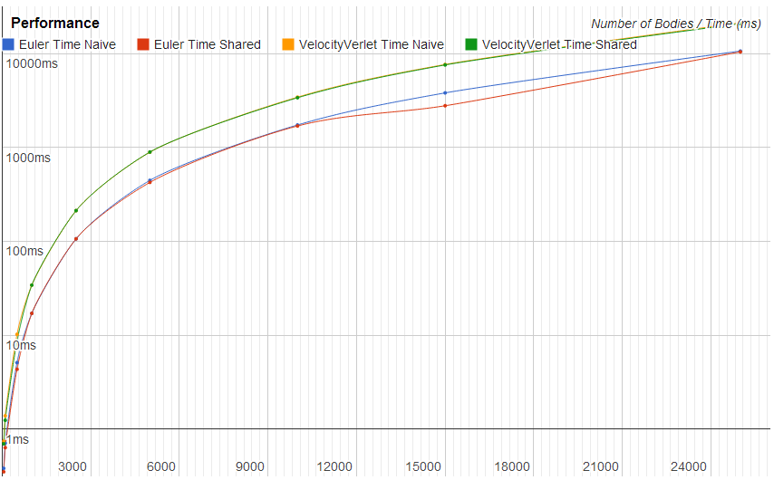

CIS565: Project 3: CUDA Simulation and GLSL Visualization
===
Fall 2013

---
NOTE:
---
This project absolutely needs a recent graphics card with OpenGL 4.0+ due to the use of tessellation shaders.

---
INTRODUCTION:
---
Part 1 of this project deals with an N body simulation that is based on gravitational constants and heavenly bodies orbitting a large mass.
Part 2 of this project is an SPH simulation base upon the original N-Body simulation using papers by Muller, Monaghan as reference.

---
Part 1: N Body Simulation
---

A basic formulation of acceleration due to a body's mass is used as 

Using Shared Memory: Shared memory is used to cache the bodies so that threads in a warp can run over multiple bodies without having to access global memory for each of those. This helps speed up execution time and N bodies can be brought into the buffer P at a time.

Extended the framework:
* **Tessellation Shaders**: The plane is *tessellated based on camera distance* with them corresponding to levels of tessellation 2, 4 and 6
* **Geometry Shaders**: The geometry shader is used on the plane to visualize the tessellation. The distance from the original triangles is stored and the distance from the tessellated triangles is stored and this is visualized as *thicker lines for the original triangles and thinner lines for the newly generated ones*.
* **Velocity Verlet Integration**: An energy preserving velocity verlet integration scheme is implemented and can be switched to by using the *'i' and 'I' key* on the keyboard. RK4 is on the list but not yet implemented.
* **Mouse interaction**: Mouse interactions works like in Maya, right click to zoom in and out, left click to pan aronud the object.

Here, we can see: 
* 1 is the highest level tessellation (level 6)
* 2 is the medium level tessellation (levle 4)
* 3 is the lowest level tessellation (levle 2)

Here we can see the velocity verlet integration.

---
Part2: SPH Fluid Simulation
---

For a simulation to build upon this N-Body interaction, I've implemented a very basic SPH simulation with forces based on pressure and viscosity. SPH fluid simulations are a standard in the industry for large scale fluid scenes in movies as well as smaller scale interactive applications. It is based on solving the Navier-Stokes equation in a Lagrangian (particle) based manner. (SPH in four days woohoo!)

[View Video](https://www.dropbox.com/s/7v53ouce59jqgng/sph_basic.mov)

Key Controls:

* Left Key	: Restart the simulation (Might be required once since the first simulation isn't stable sometimes)
* m 		: Stop auto-rotation
* P			: Pause simulation
* p			: Step simulation one timestep
* r			: Reset camera

Mouse controls are like maya once again; left click to pan, right click to zoom

The equations are as follows:

The kernels used are as follows:

** Simulation Parameters **

The basic simulation parameters are as follows:
* Stiffness (k) : This is the magnitude of force to put the particles back in correct positions based on pressue.
* Rest Pressure : This defines the rest state pressure of the liquid. It must be non-zero for liquid behavior. If zero, the matter behaves like a gas.
* Viscosity Coefficient : This is for the viscosity damping. 
 
The tuning of these parameters is extremely painful because the mapping of virtual space to real world dimensions and SI units is not super straight forward. For this reason, 
I have only able to get the simulatino to work in certain conditions (super viscous liquid, splashy liquid, etc).

---
Performance Analysis
---
The jump from accessing all elements in global memory vs shared memory accesses in a cached pattern can be seen below. This timing is for the part one, just acceleration and integration parts timed, not the visualization stage.
 As we can see, the performance is slightly better with shared memory but not a huge amount.

SPH performance can be improved by improving the neighbor search since that is the most time consuming part of the simulation. A uniform grid itself would be quite useful.
