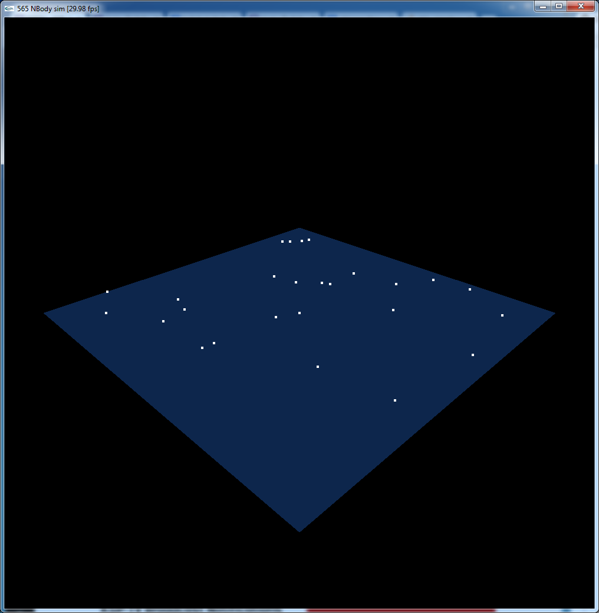
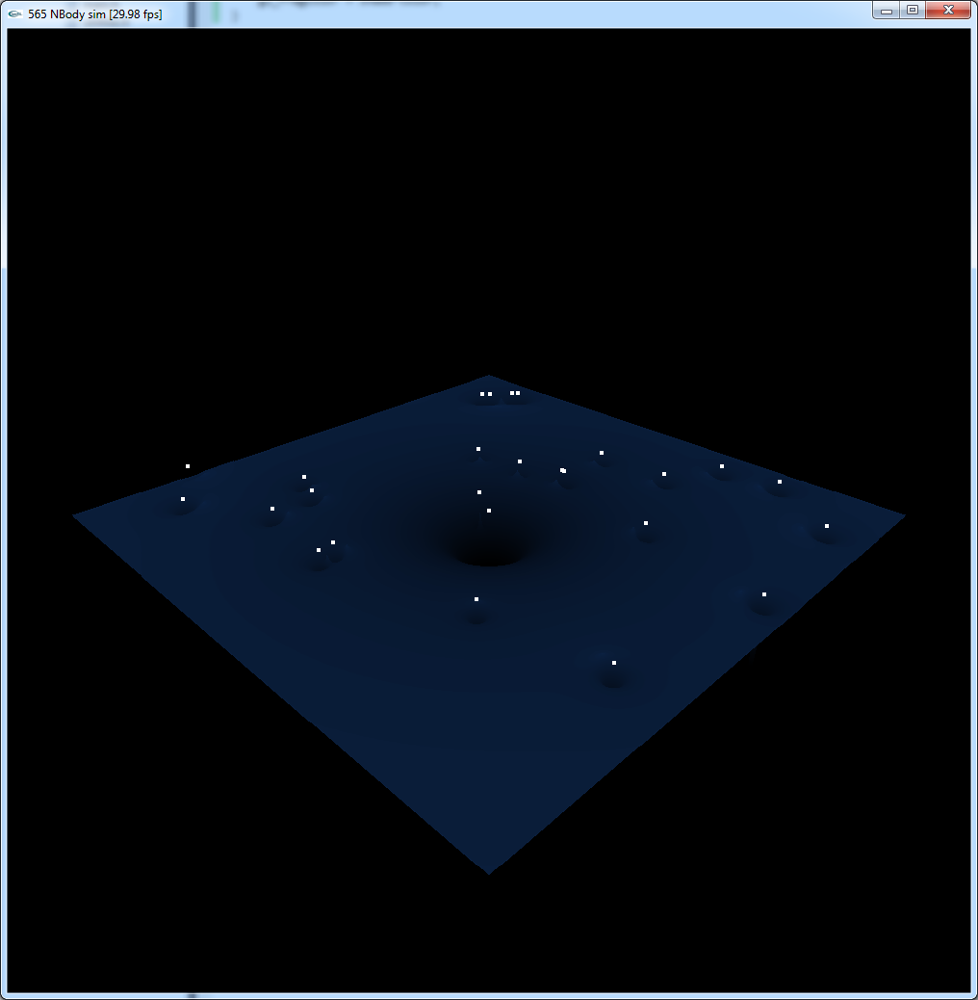
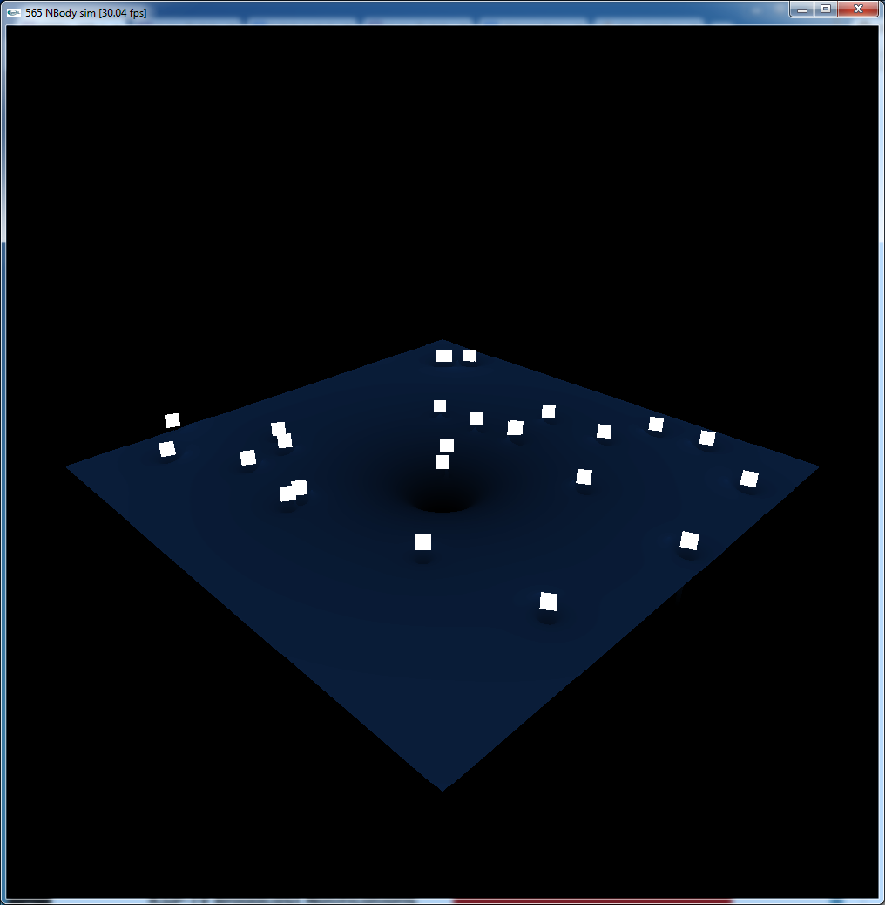
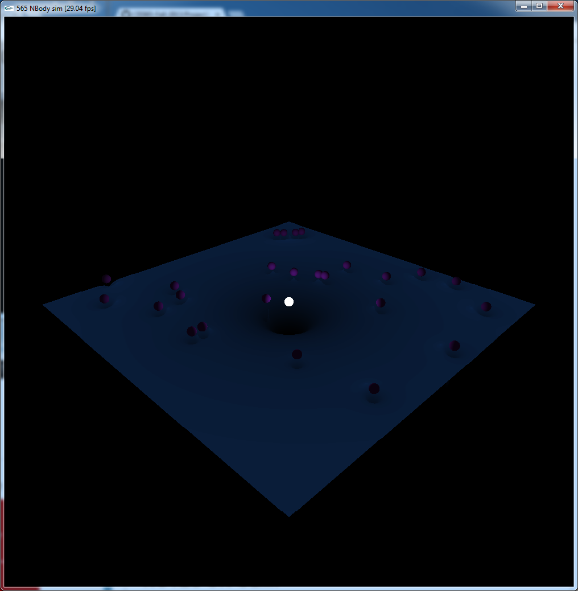
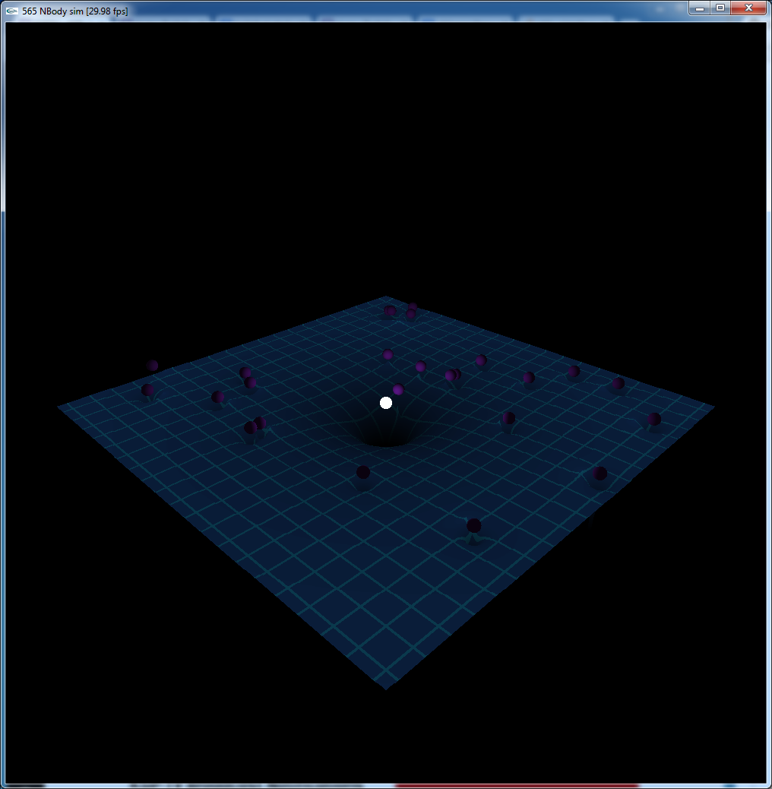

CIS565: Project 3: CUDA Simulation and GLSL Visualization
===
Fall 2013
---
Due Sunday, 10/20/2013 by 11:59:59 pm
---

---
NOTE:
---
This project requires an NVIDIA graphics card with CUDA capability! Any card
after the Geforce 8xxx series will work. If you do not have an NVIDIA graphics
card in the machine you are working on, feel free to use any machine in the SIG
Lab or in Moore100 labs. All machines in the SIG Lab and Moore100 are equipped
with CUDA capable NVIDIA graphics cards. If this too proves to be a problem,
please contact Patrick or Liam as soon as possible.

---
INTRODUCTION:
---
In this project you will be creating a 3D visualization of an N-Body system 
simulated using CUDA and OpenGL shaders. You will also be creating your own 
simulation of choice.

This project is divided into two parts. Part one will consist mostly of a 
tutorial style walkthrough of creating the N-Body sim. Part two is an open 
ended assignment to create your own simulation. This simulation can be virtually 
anything you choose, but will require approval for ideas not listed in this 
readme. 

You are also free to do as many extra simulations as you like!

---
CONTENTS:
---
The Project3 root directory contains the following subdirectories:

 *  Part1/
     *  resources/ the screenshots used in this readme.
     *  src/ contains the provided code. __NOTE:__ Shader code will be located in the PROJ3_XYZ folders
     *  PROJ_WIN/ contains a Visual Studio 2010 project file with different configurations
         *  Debug (v4.0)
         *  Release (v4.0)
         *  Debug (v5.5)
         *  Release (v5.5)
     *  PROJ_NIX/ contains a Linux makefile for building and running on Ubuntu 
        12.04 LTS. Note that you will need to set the following environment
        variables (you may set these any way that you like. I added them to my .bashrc): 
         *  PATH=$PATH:/usr/local/cuda-5.5/bin
         *  LD_LIBRARY_PATH=/usr/local/cuda-5.5/lib64:/lib
 *  Part2/ you will fill this with your own simulation code.

__NOTE:__ Since I do not use Apple products regularly enough to know what I'm doing I did not create a Mac friendly version of the project. I will award a +5 point bounty to the first person to open a pull request containing an OSX compatible version of the starter code. All runners up will receive +100 awesome points.

PART 1: CUDA NBody Simulation
===

---
REQUIREMENTS:
---
In this project, you are given code for: 
 *  Initialization
 *  Rendering to the screen
 *  Some helpful math functions
 *  CUDA/OpenGL inter-op

You will need to implement the following features:
 *  Calculating forces between all interacting bodies
 *  The same, but with shared memory
 *  Vertex shader code to render a height field
 *  Fragment shader code to light that height field
 *  Geometry shader code to create screen facing billboards from rendered points
 *  Fragment shader code to render those billboards like spheres with simple diffuse shading

You are NOT required to implement any of the following features:
 *  Prefetching (__NOTE:__ to receive +5 for this feature it must be discussed in your performance section)
 *  Tessellation shader code to refine the heightfield mesh in regions of interest
 *  Render the height map as a quad and use parallax occlusion mapping in the fragment shader to simulate the height field
 *  More interesting rendering of the scene (making some planets light sources would be cool, or perhaps adding orbit trails)
 *  Textures for the planets and/or unique looking planets
 *  Replace geometry shader billboarding with adding in simple models (e.g. a pyramid pointing in the direction of velocity)
 *  Collisions
 *  Runge Kutta integration (or anything better than the Euler integration provided)

Since we had some problems going live on time with this project you can give yourself a +5 point boost for including up to two of the above extra features. For example, adding collisions and textured planets along with completing all other required components can get you a 110% score.

---
WALKTHROUGH
---
You can choose to complete all of the TODO: tags in the kernel.cu file either before or after sprucing up the graphics, but it will be easier to see some of our improvements if you finish them before.

For the graphics, you'll see something that looks like this:



Pretty underwhelming if I do say so. Lets add some height and coloring in the height field so we can see what the potential field looks like.

Since the starter code saves a very high resolution force field to texture memory we will use that to perturb the Z components of the height field. In addition we also multiply by the camera matrix to get everything in the right place. Add the following code to your heightVS.glsl file:

```glsl
uniform mat4 u_projMatrix;
uniform sampler2D u_height;

attribute vec4 Position;
attribute vec2 Texcoords;

varying vec2 v_Texcoords;
varying float f_height;

void main(void)
{
    v_Texcoords = Texcoords;
    vec4 pos = Position;
    f_height = texture2D(u_height, Texcoords).w;
    pos.z = -0.01-clamp(f_height,0.0,2.0);
    pos = u_projMatrix * pos;
    gl_Position = pos;
}
```

You can run the code as is right now, but you'll likely see very little difference in most cases. In order to really get the feel we want, without the added complexity of doing real lighting we'll just darken the fragment color based on the height map. Add the following to your heightFS.glsl file:

```glsl
varying float f_height;

void main(void)
{
    float shade = (1.0-2.0*sqrt(f_height));
    vec4 color = vec4(0.05,0.15,0.3,1.0); 
    gl_FragColor = shade*color;
}
```

Now your height field should look closer to this:



Okay, that's a lot better, but now our planets need some attention. For this step we'll be using the geometry shader to create screen facing quads from the points that are currently being rendered. Essentially, what we want is to create a geometry shader that takes in points and emits triangle strips, so replace the version of planetGS.glsl with this:

```glsl
#version 330

uniform mat4 u_projMatrix;
uniform vec3 u_cameraPos;

layout (points) in;
layout (triangle_strip) out;
layout (max_vertices = 4) out;

out vec3 WorldCoord;
out vec3 ToCam;
out vec3 Up;
out vec3 Right;
out vec2 TexCoord;

const float scale = 0.03;
```

Before we can produce the vertices for our quad we need to figure out where they go. This code takes the vector from the point to the camera and crosses it with the up vector (usually I conform to convention and use +Y, but here I used +Z and never got around to fixing it) to produce the right vector. Next we cross the right vector and the camera vector to produce a corrected up vector. 

```glsl
void main()
{
    vec3 Position = gl_in[0].gl_Position.xyz;
    WorldCoord = Position;

    ToCam = normalize(u_cameraPos - Position);
    Up = vec3(0.0, 0.0, 1.0);
    Right = cross(ToCam, Up);
    Up = cross(Right, ToCam);
```

Now that we have the correct up and right vectors, we can emit our vertices and produce our screen facing quads:

```glsl
    vec3 Pos = Position + scale*Right - scale*Up;
    gl_Position = u_projMatrix * vec4(Pos, 1.0);
    TexCoord = vec2(0.0, 0.0);
    EmitVertex();

    Pos = Position + scale*Right + scale*Up;
    gl_Position = u_projMatrix * vec4(Pos, 1.0);
    TexCoord = vec2(0.0, 1.0);
    EmitVertex();

    Pos = Position - scale*Right - scale*Up;
    gl_Position = u_projMatrix * vec4(Pos, 1.0);
    TexCoord = vec2(1.0, 0.0);
    EmitVertex();

    Pos = Position - scale*Right + scale*Up;
    gl_Position = u_projMatrix * vec4(Pos, 1.0);
    TexCoord = vec2(1.0, 1.0);
    EmitVertex();

    EndPrimitive();
}
```



__NOTE:__ You'll notice here that the quads are not aligned to the screen, they merely face it. This is okay for our purposes because we are using them to render spheres.

With our quads we can do some very fancy things in the fragment shader. Use the following snippets to replace the existing planetFS.glsl file:

```glsl
#version 330

in vec3 WorldCoord;
in vec3 ToCam;
in vec3 Up;
in vec3 Right;
in vec2 TexCoord;
out vec4 FragColor;

void main()
{
```

This section  takes the "texture" coordinates produces in the GS and uses them to decide where in the quad this fragment is. We discard any fragments outside of our desired radius in order to simulate the edge of the sphere.

```glsl
    vec2 coord = 2.01 * (TexCoord - vec2(0.5));
    float r = length(coord);
    if (r >= 1.0) { discard; }
```

Since I designed this project with the center object being a star I execute an early out here to simply color it white.

```glsl
    float dist = length(WorldCoord);
    if(dist <= 0.01)
    {
        FragColor = vec4(1.0);
        return;
    }
```

This last segment takes care of calculating the fake intersection point and its lighting. I am using a simple diffuse + constant ambient with exponential attenuation.

```glsl
    vec3 N = Right*-coord.x + Up*coord.y + ToCam*sqrt(1-r*r);
    vec3 L = normalize(-WorldCoord);
    float light = 0.1 + 0.9*clamp(dot(N,L),0.0, 1.0)*exp(-dist);
    vec3 color = vec3(0.4, 0.1, 0.6);
    FragColor = vec4(color*light,1.0);
} 
```



The last thing we add is a little bit of procedural coloring to give a nice grid effect. Replace the boring color code in heightFS.glsl with this:

```glsl
float alpha = float(mod(v_Texcoords.x+0.025, 0.05) > 0.046 ||
                    mod(v_Texcoords.y+0.025, 0.05) > 0.046);
vec4 color = mix(vec4(0.05,0.15,0.3,1.0), vec4(0.05, 0.3, 0.4, 1.0), alpha);
```



Now we have a beautiful looking (if simple) gravity sim!


PART 2: Your CUDA Simulation
===

To complete this part of the assignment you must implement your own simulation. This can be anything within reason, but two examples that would be well suited are:

* Flocking
* Mass spring cloth/jello

Feel free to code your own unique simulation here, just ask on the Google group if your topic is acceptable and we'll probably say yes.

---
NOTES ON GLM:
---
This project uses GLM, the GL Math library, for linear algebra. You need to
know two important points on how GLM is used in this project:

* In this project, indices in GLM vectors (such as vec3, vec4), are accessed
  via swizzling. So, instead of v[0], v.x is used, and instead of v[1], v.y is
  used, and so on and so forth.
* GLM Matrix operations work fine on NVIDIA Fermi cards and later, but
  pre-Fermi cards do not play nice with GLM matrices. As such, in this project,
  GLM matrices are replaced with a custom matrix struct, called a cudaMat4, found
  in cudaMat4.h. A custom function for multiplying glm::vec4s and cudaMat4s is
  provided as multiplyMV() in intersections.h.

---
README
---
All students must replace the contents of this Readme.md in a clear manner with 
the following:

* A brief description of the project and the specific features you implemented.
* At least one screenshot of your project running.
* A 30 second or longer video of your project running.  To create the video you
  can use http://www.microsoft.com/expression/products/Encoder4_Overview.aspx 
* A performance evaluation (described in detail below).

---
PERFORMANCE EVALUATION
---
The performance evaluation is where you will investigate how to make your CUDA
programs more efficient using the skills you've learned in class. You must
perform at least one experiment on your code to investigate the positive or
negative effects on performance. 

For this Project, one of these experiments should be a comparison between the 
global and shared memory versions of the acceleration calculation function at
varying block sizes.

A good metric to track would be number of frames per second, 
or number of objects displayable at 60fps.

We encourage you to get creative with your tweaks. Consider places in your code
that could be considered bottlenecks and try to improve them. 

Each student should provide no more than a one page summary of their
optimizations along with tables and or graphs to visually explain any
performance differences.

---
THIRD PARTY CODE POLICY
---
* Use of any third-party code must be approved by asking on our Google group.  
  If it is approved, all students are welcome to use it.  Generally, we approve 
  use of third-party code that is not a core part of the project.  For example, 
  for the ray tracer, we would approve using a third-party library for loading 
  models, but would not approve copying and pasting a CUDA function for doing 
  refraction.
* Third-party code must be credited in README.md.
* Using third-party code without its approval, including using another
  student's code, is an academic integrity violation, and will result in you
  receiving an F for the semester.

---
SELF-GRADING
---
* On the submission date, email your grade, on a scale of 0 to 100, to Liam,
  liamboone+cis565@gmail.com, with a one paragraph explanation.  Be concise and
  realistic.  Recall that we reserve 30 points as a sanity check to adjust your
  grade.  Your actual grade will be (0.7 * your grade) + (0.3 * our grade).  We
  hope to only use this in extreme cases when your grade does not realistically
  reflect your work - it is either too high or too low.  In most cases, we plan
  to give you the exact grade you suggest.
* For late assignments there will be a 50% penaly per week.
* Projects are not weighted evenly, e.g., Project 0 doesn't count as much as
  the path tracer.  We will determine the weighting at the end of the semester
  based on the size of each project.

---
SUBMISSION
---
As with the previous project, you should fork this project and work inside of
your fork. Upon completion, commit your finished project back to your fork, and
make a pull request to the master repository.  You should include a README.md
file in the root directory detailing the following

* A brief description of the project and specific features you implemented
* At least one screenshot of your project running.
* A link to a video of your raytracer running.
* Instructions for building and running your project if they differ from the
  base code.
* A performance writeup as detailed above.
* A list of all third-party code used.
* This Readme file edited as described above in the README section.

---
ACKNOWLEDGEMENTS
---
I adapted the geometry shader code from [this excellent tutorial on the subject](http://ogldev.atspace.co.uk/www/tutorial27/tutorial27.html)
