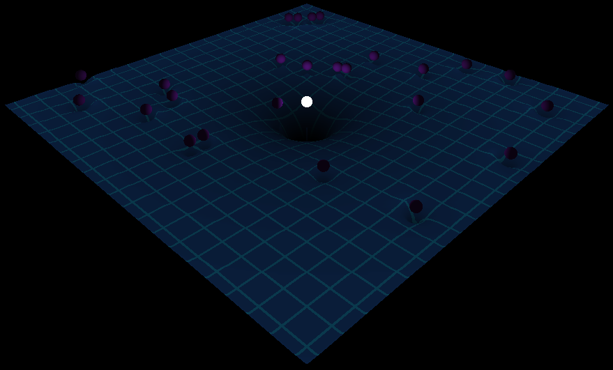
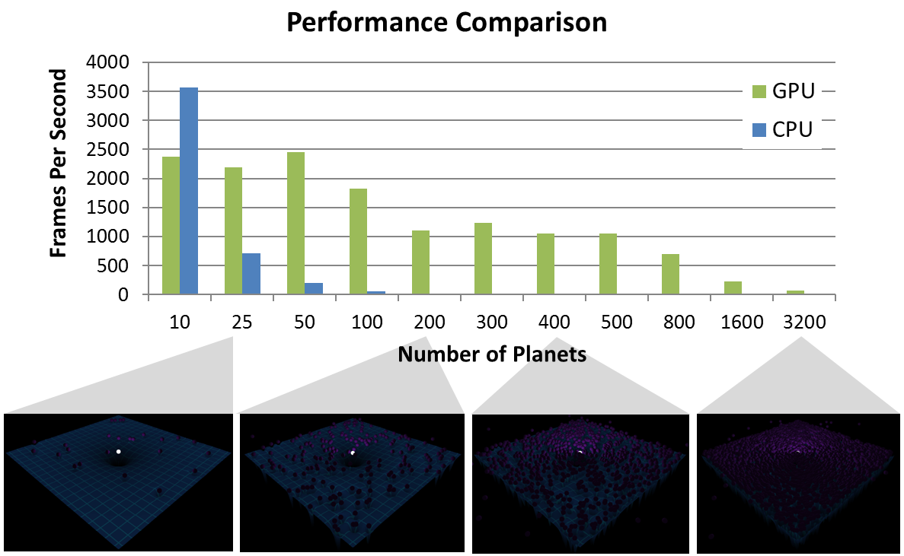
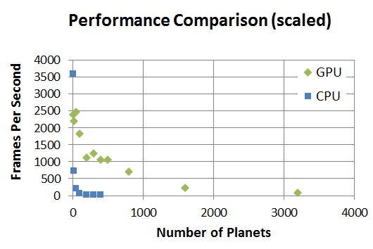
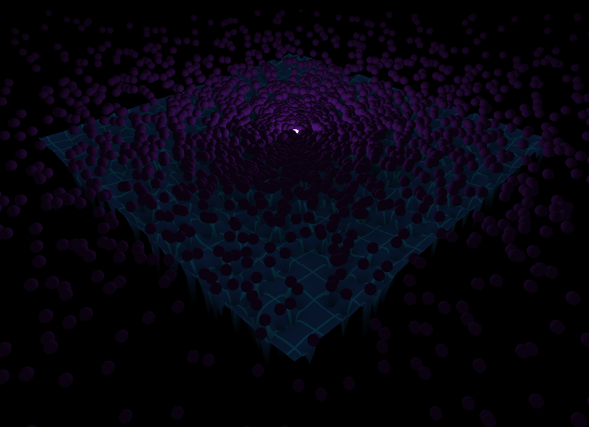

CUDA Simulation (N-Body &amp; Flocking)
=======================================

N-Body
------

### CPU vs GPU
Is GPU really faster? I implemented the same program on both CPU and GPU to compare their performance.
GPU was indeed faster. It can also be seen that the CPU exhibits the characteristics of O(n2) time complexity for force calculation.

Note: Above were calculated based only on time taken to compute the acceleration, velocity, and position of each planet.

### Galaxy

&#8593; 3200 planets after 1000 frames.

Flocking
--------

Note: This was for a class at UPenn: CIS565 Project 3 Fall 2013 (Due 10/22/2013)

