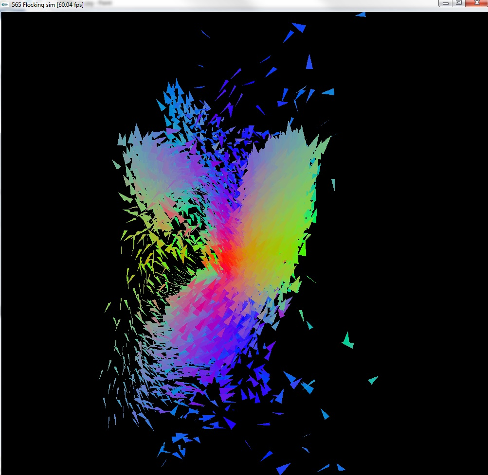

CIS565: Project 3: CUDA Simulation and GLSL Visualization
===
Fall 2013

PART 1: CUDA NBody Simulation
===

The first part of this project involves a N-body simulation of planets revolving
the sun. Each planet is assigned a random velocity. At every frame, acceleration 
is calculated using the law of universal gravitation. 

Each planet is represented as a sphere lit by the star at position (0,0,0).

Basic features include:

* Force calculation between all bodies using global and shared memory
* Height field rendering
* Fragment shader rendering of spherical planets

PART 2: Flocking Simulation
===
For part two, I implemented a flocking simulation using the methods described [here](http://www.red3d.com/cwr/boids/).
Each boid is affected by the following:

* Cohesion -- boid steers to move to the center of mass of all boids in its 
	neighborhood
* Alignmnet -- boid heads toward the average direction of its neighbors
* Separation -- boid steers to avoid being too close to its neighbors
* Avoidance -- boid tries to avoid a boundary. In my implementation, I created an 
	imaginary cube to constrain the boids.
* Wander -- adds a random velocity (constrained to a unit sphere) to each boid to 
	create interesting movement

Here are some results:

[Here](https://vimeo.com/77762701) is a video of the simulation. There are 5000 boids 
in the scene. The framerate is about 60% slower because of the screen capture. 

---
PERFORMANCE EVALUATION
---

Comparing the runtime of global versus shared memory with varying numbers of planets 
from Part 1. The block size is 128.

| Number of bodies | Global Memory | Shared Memory |
|------------------|---------------|---------------|
|               10 | 1.17          | 1.13          |
|               50 | 3.75          | 3.67          |
|              100 | 6.89          | 6.55          |
|              200 | 12.47         | 13.17         |
|              500 | 29.39         | 30.83         |
|             1000 | 58.67         | 60.7          |
|             2000 | 115.61        | 120.48        |

Comparing the effect of block size on shared and global memory. Tests are run with 500 
bodies. 

| Block Size (500 bodies) | Global Memory | Shared Memory |
|-------------------------|---------------|---------------|
|                      16 | 74.52         | 74.82         |
|                      32 | 37.47         | 37.92         |
|                      64 | 29.64         | 31.6          |
|                     128 | 29.39         | 30.88         |
|                     256 | 29.35         | 31.22         |

In both cases, global and shared memory produced similar results. Surprisingly, shared
memory is actually slower than global memory for larger number of bodies and for all
block sizes. The only time that shared memory improved performance is when there are
less than 100 bodies in the scene.
