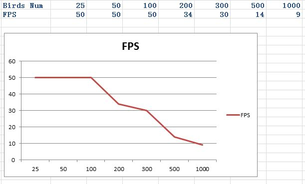

CIS565: Project 3: CUDA Simulation and GLSL Visualization
===
Fall 2013
---
Yuqin Shao
---

---
Features
---
I implemented the flocking in Part 2. Here is a youtube link of vedio demo http://youtu.be/RyLhyb3WIGc.

---
Screenshots of part2
---
The number of birds in the picture is 500

---
More Details 
---
Firstly, I changed the geometry shader. Instead of having one color all the time, I make the flocking changing based
on their positions in screen. Looks fine.
Seconnly, in terms of the problem that all birds flying out of the screen. What I did is that for every frame, I check 
each birds position. When the time ther are all out of a pre-defined range, I'll add a steering force to make their 
flying back. I just created a random position in a range that is in the middle of the screen, and make birds flying 
towards it.
I used the thrust device pointer to implement a string compaction method when checking positions of birds. This could
make the step much faster. I got the idea from last project.

Finally, in terms of the flocking itself. I had a hard time finding a good value for parameters like the size of neigh-
boring circle. Sometimes, I just don't know why the cohesion force is over large and make all birds gather to the center.
The parameter in my demo is a "comparatively" better one. Seems fine. 

---
PERFORMANCE EVALUATION
---

Just have no idea the shared memory method didn't improve the speed. 

---
ACKNOWLEDGEMENTS
---
I adapted the geometry shader code from [this excellent tutorial on the subject](http://ogldev.atspace.co.uk/www/tutorial27/tutorial27.html)
